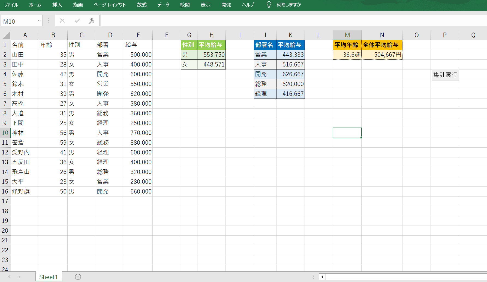

# VBA-Business-Automation-Prototype
Demonstrating logical process optimization and modular programming through VBA.

# VBA Business Process Automation: From Manual Work to 1-Click Logic

## 📌 Vision: Empowering Productivity through Logic
"Turn hours of manual work into a single click."
This project was developed as part of a Hands-on Lab to demonstrate how Excel VBA can bridge the gap between inefficient manual processes and automated data intelligence. 

Beyond just coding, this project represents a shift in mindset: from being a "manual operator" to becoming a **"Logical Process Architect."**

## 🚀 The Three Transformations (Before vs. After)

### 1. Instant Execution (Time Recovery)
- **Before:** Spending over an hour every day manually copying, pasting, and calculating hundreds of rows, leading to mental fatigue.
- **After:** Executing complex data aggregation in milliseconds. This recovered time can now be invested in higher-value strategic tasks and creative problem-solving.

### 2. Logical Accuracy (Zero Human Error)
- **Before:** Constant anxiety over "copy-paste mistakes" and "missing data" inherent in manual handling.
- **After:** By implementing "If-Then" logic and modular sub-routines, human error is virtually eliminated. The reliability of the output ensures data integrity for executive decision-making.

### 3. Technical Confidence (Bridging to Python/AWS)
- **Before:** Viewing programming as a world for "someone else."
- **After:** Experiencing the thrill of Excel moving according to your own code. This project serves as a confident first step towards mastering Python, SQL, and AWS Cloud architecture.

## 🛠 Features & Code Architecture
This repository contains a modular VBA engine designed for clean data processing:
- **`RunAllCalculations`**: A central controller using `Application.ScreenUpdating` for high-performance execution.
- **`CalculateDepartmentAverage`**: Uses `Select Case` logic to categorize and aggregate multi-departmental datasets.
- **`CalculateAverageSalaryFullColor`**: Implements automated visual storytelling through dynamic cell formatting (RGB UI).
- **`ClearDashboard`**: A reset utility ensuring data idempotency (returning the environment to a clean state before each run).

## 🚀 Future Roadmap
The logic established here will be migrated to a modern cloud stack:
- **Cloud Migration:** Transitioning to **Python (Pandas)** for large-scale data science.
- **Automated Pipeline:** Using **AWS Lambda** to automate data fetching via **Salesforce APIs**.

---
**Ryo Goto** | IT Operations & Project Management Professional
*Currently bridging Psychology and Technology to lead organizational DX.*

### Execution Result

