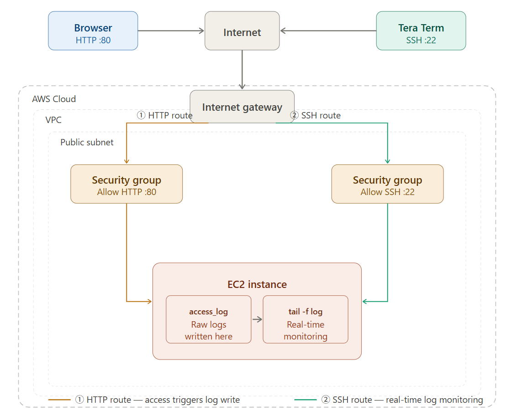

# aws-ec2-live-log-monitoring
An IaC (CloudFormation) hands-on project for real-time EC2 log tracking and security group validation.

# aws-ec2-live-log-monitoring

An Infrastructure as Code (IaC) hands-on project demonstrating rapid web server deployment (Amazon Linux 2) on AWS. This repository validates network security controls (Security Groups) and captures real-time raw access logs to understand the mechanics of security auditing solutions (e.g., Change Auditor) from an infrastructure perspective.

---

## 🛠️ Architecture Overview

This project establishes a dual-routing network architecture to dynamically monitor how infrastructure-level firewall rules impact application-level log generation.
- **The Front Door:** HTTP route (Port 80) for user interaction.
- **The Back Door:** SSH route (Port 22) for real-time log auditing.



---

## 📂 Implementation Steps

### 1. Provisioning via CloudFormation (IaC)
Leveraged Infrastructure as Code to deploy a reproducible stack utilizing a YAML definition file. The stack automates the creation of:
- Virtual Private Cloud (VPC) & Public Subnet
- Security Groups (SG) with modular ingress rules
- EC2 Instance (Amazon Linux 2) pre-configured with Apache Web Server via `UserData` bootstrapping

### 2. Live Log Interception via SSH
Established a secure SSH connection to the EC2 instance using Tera Term and executed the following command to spin up a live audit stream:

```bash
sudo tail -f /var/log/httpd/access_log
