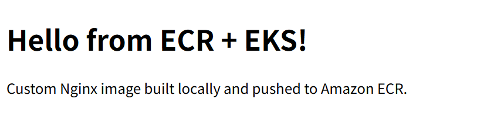
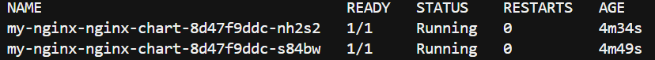
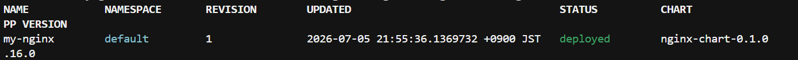
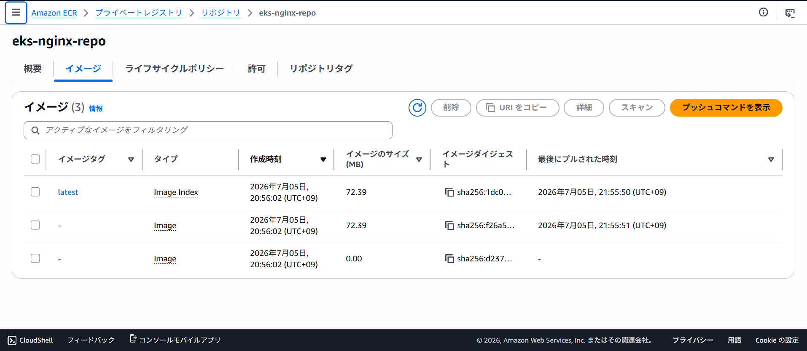

# ECR + Helm + EKS Nginx Deployment

## Overview

This project builds a custom Nginx Docker image, pushes it to Amazon ECR,
and deploys it to an EKS cluster using Helm.

## Architecture

- **Amazon ECR** — Private container registry storing the custom Nginx image
- **Amazon EKS** — Kubernetes cluster provisioned with Terraform
- **Helm** — Package manager used to deploy and manage Kubernetes resources
- **HPA** — Automatically scales Pods based on CPU utilization

## Flow

```
Local PC
  └── docker build (custom Nginx + index.html)
        └── docker push → Amazon ECR
                            └── EKS pulls image → Helm deploys → ELB exposes
```

## Demo

### Custom Nginx served via ELB



The page confirms the custom image built locally was successfully pulled
from ECR and served through Kubernetes.

### Pods running on EKS



Two Pods running the custom Nginx image, deployed via Helm.

### Helm release



Managed as a Helm release — a single `helm install` command deploys
the Deployment, Service, and HPA together.

### ECR repository



The custom image stored in Amazon ECR. Note the "Last pulled" timestamp
matches the deployment time — confirming EKS pulled directly from ECR.

## Key Learnings & Pitfalls

| # | Learning | Detail |
|---|----------|--------|
| 1 | Docker Desktop must be running before `docker build` | Engine not started → `npipe` connection error; always verify Engine running status first |
| 2 | `helm create` generates extra templates requiring values | `serviceaccount`, `ingress`, `httproute` templates need corresponding entries in `values.yaml` or deployment fails |
| 3 | `helm uninstall` must precede `terraform destroy` | The LoadBalancer Service creates an ELB outside Terraform's control; skipping this step leaves an orphaned, billable resource |
| 4 | ECR image must exist before EKS pulls it | Build and push the image before deploying the Helm chart, or Pods enter `ImagePullBackOff` state |
| 5 | ECR repository cannot be deleted while it contains images | Images pushed to ECR are not managed by Terraform; they must be manually deleted from the console before `terraform destroy`, or the destroy fails with `RepositoryNotEmptyException` |

## Files

| File/Folder | Description |
|-------------|-------------|
| `app/Dockerfile` | Custom Nginx image definition |
| `app/index.html` | Custom HTML served by Nginx |
| `terraform/ecr.tf` | ECR repository provisioned with Terraform |
| `terraform/eks.tf` | EKS cluster and node group |
| `nginx-chart/` | Helm chart for Nginx deployment |
| `nginx-chart/values.yaml` | Configurable values (image URL, replicas, HPA settings) |
