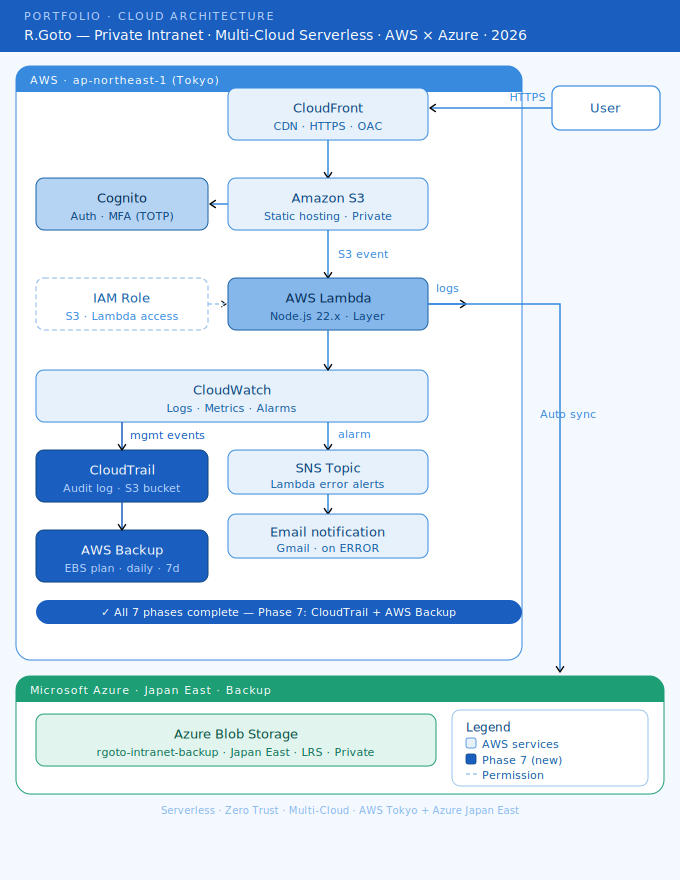

# Private Intranet — Multi-Cloud Serverless Architecture

A fully serverless, authentication-protected private intranet built on AWS, with automated multi-cloud backup to Microsoft Azure.

---

## Overview

This project demonstrates enterprise-level cloud architecture skills, including Zero Trust security, serverless design, and multi-cloud data redundancy. Built entirely from scratch as a portfolio project targeting cloud advisory and cloud architect roles at major foreign-affiliated companies.

---

## Architecture

```
User ↦→ CloudFront (CDN + HTTPS) → S3 (Static Hosting) → Cognito (Auth + MFA) ↦→ Private Intranet HTML ↦→ Media Gallery
(CloudFront URL) S3 Event ↦→ Lambda (Node.js 22.x) ↦→ Azure Blob Storage (Auto Backup)
CloudTrail → S3 (Audit Logs) | AWS Backup → EBS Snapshots (Auto Backup Plan)
CloudWatch (Logs + Monitoring) → SNS → Email Alert
```

---

## Architecture Diagram



---

## Tech Stack

| Layer | Service |
|---|---|
| CDN | AWS CloudFront |
| Storage | AWS S3 |
| Auth | AWS Cognito + MFA (TOTP) |
| Compute | AWS Lambda |
| Cloud Backup | Microsoft Azure Blob Storage |
| Audit Logging | AWS CloudTrail |
| Backup Automation | AWS Backup |
| Monitoring | AWS CloudWatch + SNS |
| Runtime | Node.js 22.x |
| Library | @azure/storage-blob |

---

## Phases

### Phase 1: HTML Development

- Built a single-page application (SPA) with a multi-section dashboard
- Sections: Home, Manat, Archive, Media Gallery, Career

### Phase 2: S3 Static Hosting

- Deployed HTML to S3 bucket `rgoto-private-intranet`
- Configured bucket policy for CloudFront-only access

### Phase 3: CloudFront + Cognito + MFA

- Issued HTTPS endpoint via CloudFront distribution
- Implemented Cognito User Pool with email + password authentication
- Enforced MFA using TOTP (Microsoft Authenticator)
- Frontend-based auth flow using `sessionStorage`

### Phase 4: Multi-Cloud Backup (AWS → Azure)

- Created Azure Blob Storage account (`rgotointranet`) in Japan East
- Built a Lambda function triggered by S3 `ObjectCreated` events
- Packaged `@azure/storage-blob` as a Lambda Layer via CloudShell
- Configured environment variables for secure credential management
- Verified end-to-end sync: S3 upload → Lambda → Azure Blob Storage

### Phase 5: Media Gallery

- Added Media Gallery section to intranet HTML
- Served video/image assets via CloudFront URLs
- Leveraged existing lightbox UI for full-screen playback

### Phase 6: CloudWatch Monitoring + SNS Alerting

- Created metric filter `rgoto-lambda-error-filter` on Lambda log group `/aws/lambda/rgoto-intranet-s3-to-azure-sync`
  - Pattern: `ERROR` | Namespace: `RGotoIntranet` | Metric: `LambdaErrorCount`
- Configured CloudWatch Alarm `rgoto-lambda-error-alarm`
  - Threshold: `LambdaErrorCount >= 1` within 5 minutes
- Created SNS topic `rgoto-lambda-error-topic` with Gmail subscription
- Verified end-to-end: triggered alarm via empty `{}` payload → `TypeError: event.Records is not iterable` → SNS email delivered

> **Note:** CloudWatch monitors Lambda's attempt to sync but cannot confirm Azure-side receipt. Automated backup verification is a planned future enhancement.

### Phase 7: CloudTrail Audit Logging + AWS Backup

#### CloudTrail

- Created trail `management-events` in ap-northeast-1 (Tokyo), multi-region enabled
- S3 bucket: `aws-cloudtrail-logs-512741504549-d94e9903`
- Logging: Management events only (Read + Write), no Data/Insights events
- Log file validation: Enabled
- SSE-KMS encryption: Disabled (cost reason — SSE-S3 default encryption applied)
- CloudWatch Logs integration: Disabled (cost reason — manual log review via S3 sufficient for this scope)
- Verified: CloudTrail event history confirmed live capture of management operations

#### AWS Backup

- Created backup plan `rgoto-ebs-backup-plan`
  - Rule: `rgoto-ebs-daily-backup` | Schedule: Daily at 00:30 JST
  - Retention: 7 days | Vault: Default
  - Malware scan: Disabled (requires GuardDuty — cost reason)
- Resource assignment: `rgoto-ebs-resource` (EBS, all volumes, default IAM role)
- Current state: Plan configured and ready; no EBS volumes exist in the current Serverless architecture
  - When EC2 instances are added in future phases, automated daily backups will activate immediately

> **Production note:** In a production environment, SSE-KMS encryption and CloudWatch Logs integration for CloudTrail should both be enabled. KMS provides key usage audit trails; CloudWatch Logs enables real-time alerting on suspicious API calls. Both were omitted here for cost reasons and are documented as known gaps.

---

## Security Design

- **Zero Trust:** No public access to S3 or Azure Blob Storage
- **CloudFront-only:** S3 bucket accessible only via OAC
- **MFA enforced:** TOTP-based second factor via Cognito
- **Private Blob:** Azure container configured with `Anonymous access: Disabled`
- **Secrets management:** Azure credentials stored as Lambda environment variables
- **Audit trail:** CloudTrail capturing all management-plane operations from Phase 7 onward

---

## Key Learnings

- Lambda@Edge Viewer Request functions **cannot make outbound HTTP calls** — Cognito token exchange at the edge is architecturally infeasible
- Node.js runtime version compatibility is a live constraint in Lambda environments
- Data assets (S3) require multi-cloud backup; infrastructure config can be rebuilt
- Frontend-based auth (`sessionStorage`) is a viable fallback when edge auth fails
- Private storage returning 403 is correct behavior — confirms security is working
- **CloudTrail is not retroactive** — audit logging begins from trail creation, not from account inception
- **AWS Backup plan can be pre-configured** before EC2/EBS resources exist; backups activate automatically upon resource creation
- **Serverless vs. Kubernetes trade-off:** Current architecture is fully Serverless (no EC2/EBS required); EKS-based container workloads are planned as a separate future project

---

## Infrastructure Details

| Resource | Value |
|---|---|
| AWS Region | ap-northeast-1 (Tokyo) |
| Azure Region | Japan East |
| Runtime | Node.js 22.x |
| Lambda Layer | azure-storage-blob-Layer-v1 |
| CloudTrail Trail | management-events |
| CloudTrail S3 Bucket | aws-cloudtrail-logs-512741504549-d94e9903 |
| Backup Plan | rgoto-ebs-backup-plan |
| Backup Rule | rgoto-ebs-daily-backup (daily, 7-day retention) |

> Specific endpoint URLs and bucket names are omitted for security reasons.

---

## Future Enhancements

- AWS WAF integration for geo-blocking and web-attack prevention
- EC2 + EBS hands-on: snapshot, restore, and automated backup verification
- EKS (Kubernetes) workload migration: containerize intranet app with ECR + Helm
- CloudTrail → CloudWatch Logs integration for real-time suspicious activity alerting
- Automated Azure-side backup verification (confirm receipt beyond Lambda success)
