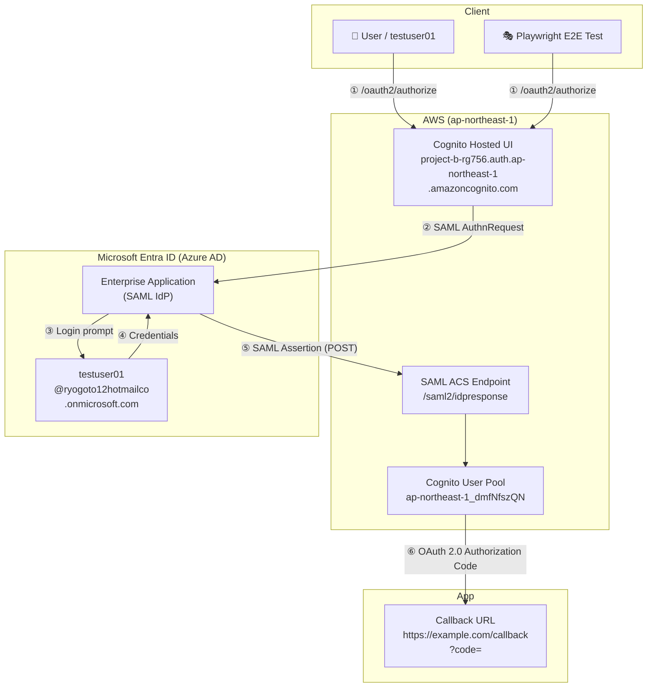

# Project B — AWS Cognito × Microsoft Entra ID SAML Federation

A hands-on cloud engineering project demonstrating enterprise identity federation between Microsoft Entra ID (formerly Azure AD) and AWS Cognito using SAML 2.0, with infrastructure managed by Terraform and end-to-end tests automated with Playwright.

---

## Architecture Overview



**Identity Provider (IdP):** Microsoft Entra ID  
**Service Provider (SP):** AWS Cognito User Pool  
**Protocol:** SAML 2.0 → OAuth 2.0 Authorization Code Flow  
**IaC:** Terraform (AWS side) / Manual (Entra ID side)  
**Region:** ap-northeast-1 (Tokyo)

---

## Phases

### Phase 1 — Microsoft Entra ID Tenant Setup

Configured the Microsoft Entra ID tenant and created a test user (`testuser01`) for SAML federation testing.

→ Details: [docs/phase1-entra-tenant.md](docs/phase1-entra-tenant.md)

---

### Phase 2 — AWS Cognito Base Infrastructure (Terraform)

Provisioned the core Cognito resources using Terraform:

- **Cognito User Pool** — user directory with email-based sign-in
- **User Pool Domain** — Hosted UI endpoint
- **App Client** — OAuth 2.0 client configuration
- **Outputs** — Hosted UI URL, User Pool ID, App Client ID

→ Details: [docs/phase2-cognito-base.md](docs/phase2-cognito-base.md)

---

### Phase 3 — SAML IdP Integration (Entra ID → Cognito)

Registered Microsoft Entra ID as a SAML Identity Provider in Cognito and validated the end-to-end authentication flow.

#### Entra ID Configuration (Manual)

1. Created an **Enterprise Application** in Entra ID Admin Center with SAML SSO
2. Configured SAML Basic Settings:
   - **Entity ID (Identifier):** `urn:amazon:cognito:sp:ap-northeast-1_dmfNfszQN`
   - **Reply URL (ACS URL):** `https://ap-northeast-1_dmfNfszQN.auth.ap-northeast-1.amazoncognito.com/saml2/idpresponse`
3. Assigned `testuser01` to the application
4. Downloaded **Federation Metadata XML**

#### Terraform Configuration

**New file — `terraform/idp.tf`**

```hcl
resource "aws_cognito_identity_provider" "entra_id" {
  user_pool_id  = aws_cognito_user_pool.main.id
  provider_name = "EntraID"
  provider_type = "SAML"

  provider_details = {
    MetadataFile = file("${path.module}/entra-metadata.xml")
    IDPSignout   = "false"
  }

  attribute_mapping = {
    email    = "http://schemas.xmlsoap.org/ws/2005/05/identity/claims/emailaddress"
    username = "http://schemas.xmlsoap.org/ws/2005/05/identity/claims/name"
  }
}
```

**Modified — `terraform/cognito.tf`** (App Client)

```hcl
supported_identity_providers = ["COGNITO", "EntraID"]

depends_on = [aws_cognito_identity_provider.entra_id]
```

#### Troubleshooting: Terraform Race Condition

**Problem:** On the first `terraform apply`, the `aws_cognito_user_pool_client` update ran in parallel with `aws_cognito_identity_provider` creation, causing:

```
InvalidParameterException: The provider EntraID does not exist for User Pool ap-northeast-1_dmfNfszQN
```

**Root cause:** Terraform's parallel execution started the App Client update before the IdP resource was fully registered in the AWS backend.

**Fix:** Added `depends_on = [aws_cognito_identity_provider.entra_id]` to the App Client resource, forcing sequential execution.

```
terraform apply  →  Apply complete! Resources: 0 added, 2 changed, 0 destroyed.
```

#### Verification — End-to-End SAML Flow

Accessed the Cognito Hosted UI and clicked the **EntraID** button:

```
Hosted UI → EntraID (SAML) → testuser01 login → Cognito validates assertion
→ Redirects to: https://example.com/callback?code=<authorization_code>
```

The `?code=` parameter in the callback URL confirms that Cognito issued an OAuth 2.0 Authorization Code after successful SAML authentication — **complete success**.

#### Security Notes

- `entra-metadata.xml` is excluded from version control via `.gitignore` (contains Entra Tenant ID)
- AWS Account ID and Entra Tenant ID are masked in all public documentation

---

### Phase 4 — Attribute Mapping & App Client Hardening

Refined the SAML attribute mapping and App Client configuration to enforce strict OAuth scopes and callback URL validation, ensuring only the authorized redirect URI receives the authorization code.

---

### Phase 5 — E2E Test Automation (Playwright)

Automated the full SAML authentication flow using **Playwright + TypeScript**, verifying that the end-to-end federation pipeline works reliably across browsers.

#### Test Setup

```
npm install
# Copy .env.example to .env and fill in credentials (never committed)
npx playwright test
```

#### Environment Variables (`.env` — not committed)

| Variable | Description |
|---|---|
| `TEST_USERNAME` | Entra ID test user UPN |
| `TEST_PASSWORD` | Test user password |
| `COGNITO_CLIENT_ID` | Cognito App Client ID |
| `COGNITO_HOSTED_UI` | Cognito Hosted UI base URL |
| `CALLBACK_URL` | OAuth 2.0 redirect URI |

#### Test: `tests/saml-auth.spec.ts`

The test automates these steps:

1. Navigate to Cognito Hosted UI `/oauth2/authorize` with PKCE parameters
2. Click **Sign in with EntraID** button
3. Enter Entra ID credentials (email → password)
4. Handle "Stay signed in?" prompt (supports both EN and JP UI)
5. Assert callback URL contains `?code=` (OAuth authorization code received)

#### Test Results

| Browser | Result | Notes |
|---|---|---|
| Chromium | ✅ Pass | |
| Firefox | ✅ Pass | |
| WebKit | ❌ Skip | Windows browser emulation limitation — acceptable |

#### Debugging Resolved During Phase 5

| Issue | Resolution |
|---|---|
| `testuser01` forced password change on first login | Manually set password to permanent via Entra ID admin |
| "Stay signed in?" button not found in JP locale | Added `/^(No\|いいえ)$/` regex to handle both EN/JP |
| MFA redirect to `mysignins.microsoft.com` | Disabled Registration Campaign → Authenticator policy → Security Defaults |

---

## Repository Structure

```
project-b/
├── docs/
│   ├── images/
│   ├── phase1-entra-tenant.md
│   └── phase2-cognito-base.md
├── tests/
│   ├── saml-auth.spec.ts    # SAML E2E test (Phase 5)
│   └── example.spec.ts
├── playwright.config.ts
├── package.json
├── .env                     # credentials — NOT committed (.gitignore)
└── terraform/
    ├── cognito.tf            # User Pool, Hosted UI domain, App Client
    ├── idp.tf                # Entra ID SAML Identity Provider (Phase 3)
    ├── outputs.tf
    ├── provider.tf
    ├── variables.tf
    └── .gitignore            # excludes entra-metadata.xml, tfstate
```

---

## Teardown — Terraform Destroy

After completing all phases, destroy the AWS resources to avoid ongoing costs.

> ⚠️ **Verify the E2E tests pass one final time before destroying.**

```bash
cd terraform/

# Preview what will be destroyed
terraform plan -destroy

# Destroy all resources
terraform destroy
```

**Resources destroyed:**

| Resource | Type |
|---|---|
| Cognito User Pool | `aws_cognito_user_pool` |
| User Pool Domain | `aws_cognito_user_pool_domain` |
| App Client | `aws_cognito_user_pool_client` |
| Entra ID SAML IdP | `aws_cognito_identity_provider` |

> **Note:** The Microsoft Entra ID Enterprise Application must be deleted manually from the [Entra ID Admin Center](https://entra.microsoft.com) — it is not managed by Terraform.

---

## Key Learnings

- **SAML 2.0 vs OAuth 2.0** — Entra ID acts as the authentication layer (SAML); Cognito converts this into an OAuth Authorization Code for the application layer
- **Terraform resource ordering** — `depends_on` is required when a resource references another that AWS may not have fully propagated yet
- **IdP provider name consistency** — `provider_name` in `aws_cognito_identity_provider` must exactly match the string used in `supported_identity_providers` of the App Client
- **Metadata XML sensitivity** — Federation metadata contains the Tenant ID and must be excluded from public repositories
- **E2E testing identity flows** — Browser-based SSO flows require handling locale-specific UI variations and MFA policy side-effects; using `.env` for credentials keeps tests portable and secrets out of git
- **Security Defaults vs Conditional Access** — Microsoft's Security Defaults enforce MFA for all users; disabling them (or using Conditional Access exclusions) is required for automated test accounts

---

## Environment Reference

| Item | Value |
|---|---|
| AWS Region | ap-northeast-1 (Tokyo) |
| Cognito User Pool ID | `ap-northeast-1_dmfNfszQN` |
| Cognito App Client ID | `46t5eam49gvigsgqk4es2h0s9` |
| Cognito Hosted UI | `https://project-b-rg756.auth.ap-northeast-1.amazoncognito.com` |
| Entra ID Tenant | `ryogoto12hotmailco.onmicrosoft.com` |
