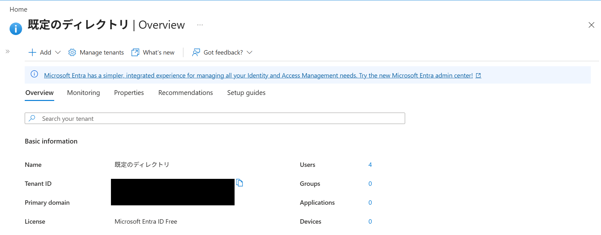
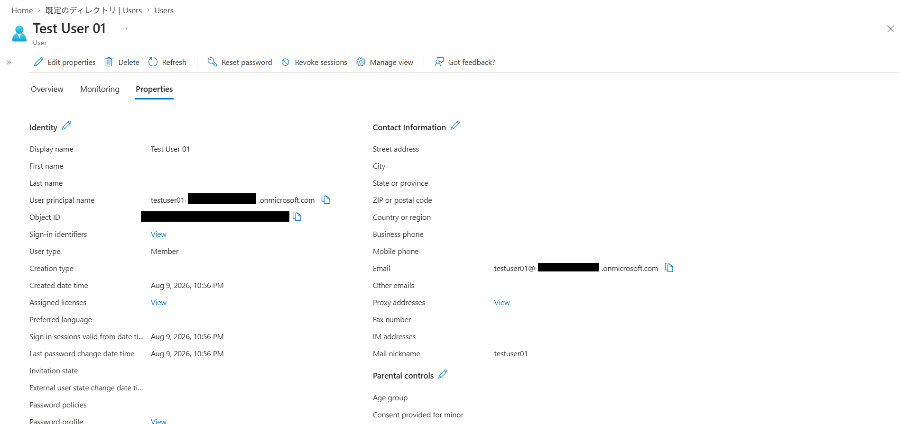

# Phase 1 — Microsoft Entra ID Tenant Setup (IdP side)

Project B: Cognito + SAML + Microsoft Entra ID federation
Date: 2026-08-09 / Branch: `b-phase1-entra-tenant`

## Objective

Prepare the Identity Provider (IdP) side of the SAML federation: verify the Entra ID
tenant and create a test user that will later sign in to Cognito Hosted UI via SAML.

No AWS resources are touched in this phase. The tenant has no dependencies on other
phases, which is why it comes first — the Entra SAML app (Phase 3) needs values
generated by Cognito (Phase 2), so it must wait.

## 1. Tenant verification

Reused the existing default tenant (created with my Azure account) instead of
creating a new one. Verified on the Entra ID Overview page:

| Item | Value |
|---|---|
| Tenant ID | `********-****-****-****-************` (masked) |
| Primary domain | `<tenant-domain>.onmicrosoft.com` |
| License | Microsoft Entra ID Free |

Note: SAML enterprise applications can be created on the Free license — no paid
plan is required for this project.

## 2. Test user creation

Entra ID > Users > New user > Create new user:

| Item | Value |
|---|---|
| User principal name | `testuser01@<tenant-domain>.onmicrosoft.com` |
| Display name | Test User 01 |
| Email (Contact Information) | `testuser01@<tenant-domain>.onmicrosoft.com` |
| Account enabled | Yes |

**Why the Email attribute matters**: in Phase 4, Cognito maps the SAML assertion's
email claim to its own `email` attribute. If the source attribute is empty, user
provisioning in Cognito fails at first sign-in. Setting it now avoids a classic
troubleshooting session later.

## Security notes

- Tenant ID and Object ID are masked in all screenshots (minimize public exposure
  even for non-secret identifiers).
- Test user password is stored locally only — never committed.

## Outcome

- IdP tenant confirmed usable (Free license)
- Test user ready for SAML sign-in tests (Phase 5)
- Values recorded for Phase 3: primary domain

## Next: Phase 2 — Cognito User Pool + Hosted UI domain (Terraform, AWS side)
