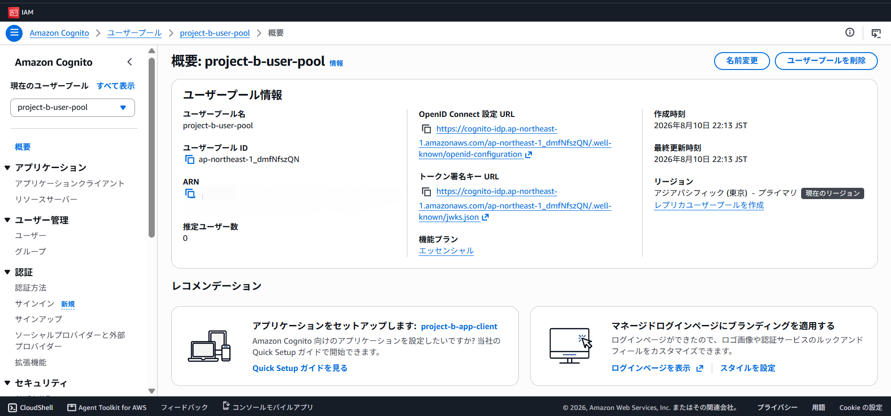
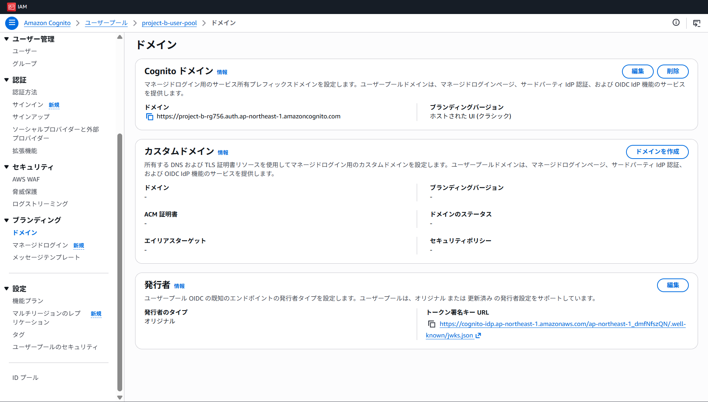
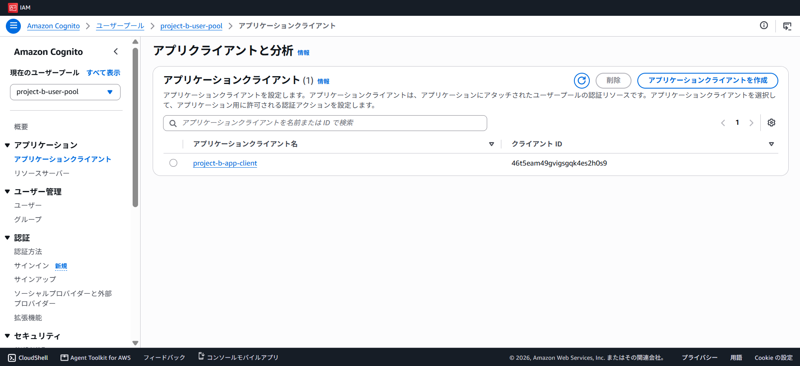

# Phase 2: Cognito User Pool Base Infrastructure (Terraform)

## Overview

This phase provisions the core AWS Cognito infrastructure using Terraform as the foundation for SAML-based federation with Microsoft Entra ID. All three resources are managed as Infrastructure as Code (IaC) and can be reproduced from a single `terraform apply`.

## Resources Created

| Resource | Name | Purpose |
|---|---|---|
| `aws_cognito_user_pool` | project-b-user-pool | Manages user identities and authentication |
| `aws_cognito_user_pool_client` | project-b-app-client | OAuth2 client for Entra ID federation (Phase 3) |
| `aws_cognito_user_pool_domain` | project-b-rg756 | Hosts the Cognito Managed Login UI |

## Key Design Decisions

**Why Terraform instead of the AWS Console?**
Consistent with Projects A, C, and D — IaC ensures reproducibility and serves as self-documenting infrastructure. The three Cognito resources can be torn down and rebuilt identically from `terraform apply`.

**Why OAuth2 Authorization Code flow?**
SAML federation via Cognito ultimately exchanges the SAML assertion for an OAuth2 authorization code. The App Client is pre-configured with `code` flow and `email openid profile` scopes to be ready for Entra ID integration in Phase 3.

**Why email as a required schema attribute?**
The SAML assertion from Entra ID will carry the user's email. Marking it as `required = true` in the User Pool schema ensures attribute mapping in Phase 4 has a validated target field.

**Why `generate_secret = false`?**
A public client (no client secret) is sufficient for this learning project. In production, a confidential client with a secret would be used for server-side SAML flows.

## Terraform File Structure

```
project-b/terraform/
├── provider.tf          # AWS provider, Terraform version constraint
├── variables.tf         # Region, project name, domain prefix
├── cognito.tf           # User Pool, App Client, Hosted UI domain
└── outputs.tf           # Pool ID, App Client ID, Hosted UI URL
```

## Outputs (Used in Phase 3)

| Output | Value | Used For |
|---|---|---|
| `user_pool_id` | `ap-northeast-1_<masked>` | Entra ID Enterprise App configuration |
| `app_client_id` | `<masked>` | Entra ID redirect URI registration |
| `hosted_ui_domain` | `https://project-b-rg756.auth.ap-northeast-1.amazoncognito.com` | Entra ID Reply URL (ACS URL) |
| `user_pool_arn` | `arn:aws:cognito-idp:ap-northeast-1:<account-id-masked>:userpool/...` | Reference only |

> Sensitive identifiers (Account ID) are masked. Run `terraform output` in `project-b/terraform/` to retrieve actual values.

## Verification

All three resources confirmed in AWS Console (ap-northeast-1 / Tokyo):

- ✅ User Pool: `project-b-user-pool` — Pool ID visible, 0 users (expected)
- ✅ App Client: `project-b-app-client` — Client ID confirmed, no client secret
- ✅ Hosted UI Domain: `https://project-b-rg756.auth.ap-northeast-1.amazoncognito.com`

### Screenshots

**User Pool Overview**


**Hosted UI Domain**


**App Client List**


## apply Result

```
Apply complete! Resources: 3 added, 0 changed, 0 destroyed.
```

- `aws_cognito_user_pool.main` — created in 1s
- `aws_cognito_user_pool_client.main` — created in 1s
- `aws_cognito_user_pool_domain.main` — created in 2s

## Cost

Cognito User Pool: **free tier** (0–50,000 MAUs/month at no charge). Hosted UI domain: no additional cost. This phase incurs no AWS charges under normal learning usage.

## Next Phase

**Phase 3** — Register Cognito as an Enterprise Application in Microsoft Entra ID:
- Use `hosted_ui_domain` output as the ACS (Reply) URL
- Use `user_pool_id` output as the Entity ID
- Configure SAML attribute mapping (email → `email`)
