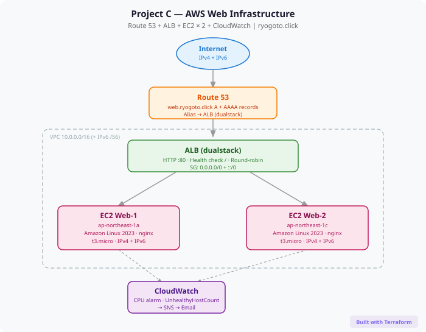

# Project C: Route 53 + ALB + EC2 × 2 + CloudWatch

A production-like public web infrastructure built entirely with Terraform on AWS.

## Architecture



## Overview

| Item | Detail |
|------|--------|
| Domain | `ryogoto.click` (registered via Route 53) |
| DNS Records | A + AAAA (dualstack IPv4 + IPv6) |
| Load Balancer | Application Load Balancer (dualstack) |
| Web Servers | EC2 × 2 (across 2 Availability Zones) |
| Web Server Software | nginx (auto-installed via user_data) |
| Monitoring | CloudWatch Alarms + SNS email notifications |
| Total Resources | 26 (managed by Terraform) |
| Region | ap-northeast-1 (Tokyo) |

## Infrastructure Components

### Networking
- VPC (`10.0.0.0/16`) with Amazon-provided IPv6 CIDR (`/56`)
- 2 Public Subnets (`ap-northeast-1a`, `ap-northeast-1c`) with IPv6 `/64` CIDRs
- Internet Gateway (IPv4 + IPv6)
- Route Table with `0.0.0.0/0` and `::/0` → IGW

### Compute
- EC2 × 2 (`t3.micro`, Amazon Linux 2023)
- IAM Role with `CloudWatchAgentServerPolicy`
- nginx auto-installed via `user_data`
- IPv6 address assigned to each instance

### Load Balancing
- ALB with `ip_address_type = "dualstack"`
- Target Group with HTTP health check (`/`, interval 30s)
- HTTP :80 listener → forward to target group

### DNS
- Route 53 public hosted zone (`ryogoto.click`)
- `A` alias record → ALB (IPv4)
- `AAAA` alias record → ALB (IPv6)
- `evaluate_target_health = true`

### Monitoring
- CloudWatch Alarm: CPU > 70% (each EC2, 2 periods of 300s)
- CloudWatch Alarm: `UnHealthyHostCount` > 0 (ALB, 1 period of 60s)
- SNS Topic → Email notification (ALARM + OK state)

## Tech Stack

- **IaC**: Terraform `~> 5.0`
- **Cloud**: AWS (ap-northeast-1)
- **OS**: Amazon Linux 2023
- **Web**: nginx
- **DNS**: Route 53 (public hosted zone)

## File Structure

```
project-c-alb-route53/
├── main.tf           # Terraform & provider config
├── variables.tf      # Variable definitions
├── terraform.tfvars  # Variable values
├── vpc.tf            # VPC, subnets, IGW, route table
├── ec2.tf            # EC2 × 2, IAM role, security groups
├── alb.tf            # ALB, target group, listener
├── route53.tf        # A + AAAA alias records
├── cloudwatch.tf     # CloudWatch alarms, SNS topic
└── outputs.tf        # ALB DNS, website URL, EC2 info
```

## Usage

```bash
# Initialize
terraform init

# Preview changes
terraform plan

# Deploy (approx. 5 min)
terraform apply

# Destroy all resources
terraform destroy
```

## Verification Steps

1. **ALB Health Check** — EC2 Console → Target Groups → `project-c-tg` → Targets tab → both instances `Healthy`
2. **Load Balancing** — Open `http://web.ryogoto.click` and refresh → alternates between `Hello from Web Server 1` and `Hello from Web Server 2`
3. **CloudWatch Metrics** — CloudWatch → Metrics → EC2 → Per-Instance → `CPUUtilization`
4. **Alarm Test** via AWS CLI:
   ```bash
   aws cloudwatch set-alarm-state \
     --alarm-name "project-c-cpu-high-web-1" \
     --state-value ALARM \
     --state-reason "Test" \
     --region ap-northeast-1
   ```

## Key Learning Points

- **IaC-first approach**: All 26 resources defined in Terraform — reproducible, reviewable, version-controlled
- **Dualstack (IPv4 + IPv6)**: VPC, subnets, EC2, and ALB all configured for dual-stack
- **High Availability**: EC2 instances placed in separate AZs (`1a` and `1c`)
- **Route 53 best practice**: ALIAS records (faster than CNAME, no extra DNS lookup)
- **Monitoring**: Both anomaly detection (ALARM) and recovery notification (OK) via `ok_actions`
- **Workflow**: *Design & build with Terraform, verify with AWS Console* — the real-world standard

## Notes

- Domain `ryogoto.click` is registered in Route 53 and retained after `terraform destroy`
- The hosted zone was auto-created at domain registration; Terraform references it via `data "aws_route53_zone"`
- HTTP only (no HTTPS) — ACM + HTTPS will be added in a future project
