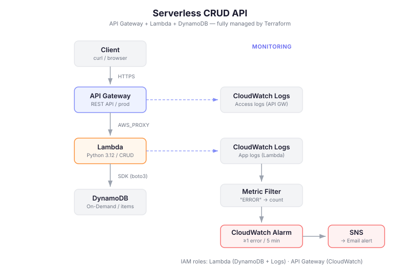

# Serverless CRUD API with Terraform

## Overview

A fully serverless REST API built on AWS, provisioned entirely with Terraform.
Supports Create, Read, Update, and Delete operations with structured logging,
error-based alerting, and access log monitoring. Designed to demonstrate
Infrastructure as Code reproducibility — `terraform destroy` and `terraform apply`
recreate the entire stack from scratch.

## Architecture

## API Endpoints

| Method | Path | Description |
|--------|------|-------------|
| GET | /items | List all items |
| POST | /items | Create a new item |
| GET | /items/{id} | Get a single item |
| PUT | /items/{id} | Update an item |
| DELETE | /items/{id} | Delete an item |

## Key Learnings & Pitfalls

| # | Learning | Detail |
|---|----------|--------|
| 1 | PowerShell mangles JSON in `curl` commands | Use file-based payloads (`-d "@payload.json"`) with `[System.IO.File]::WriteAllText()` to avoid BOM and encoding issues |
| 2 | Lambda auto-creates a Log Group outside Terraform | Use `terraform import` to bring it under Terraform management, or pre-create it in Terraform before the first invocation |
| 3 | API Gateway needs its own IAM role for CloudWatch | Lambda logs via its own role, but API Gateway is a separate service requiring a dedicated role with `AmazonAPIGatewayPushToCloudWatchLogs` |
| 4 | WARNING vs ERROR distinction matters for ops | Client errors (404, 400) should log as WARNING; only server failures (500) as ERROR — this prevents false alarms from normal user mistakes |
| 5 | Cold start vs warm start performance gap | First invocation ~500ms (cold start), subsequent calls ~2-3ms (warm). Predictable with Lambda but worth monitoring |
| 6 | `sensitive = true` for email variables | Prevents credentials from appearing in Terraform plan output or state file diffs; actual values go in `terraform.tfvars` (git-ignored) |
| 7 | DynamoDB On-Demand vs Provisioned | PAY_PER_REQUEST needs no capacity planning and costs near-zero at low traffic — ideal for dev/portfolio projects |

## Reproducibility

This project was verified by running `terraform destroy` followed by `terraform apply`,
confirming that the entire 31-resource stack is recreated from code alone with no manual steps.

## Files

| File/Folder | Description |
|-------------|-------------|
| `main.tf` | Provider configuration (AWS, ap-northeast-1) |
| `variables.tf` | Input variables (region, project name, alarm email) |
| `outputs.tf` | Outputs (table name, function ARN, API endpoint) |
| `dynamodb.tf` | DynamoDB table (on-demand, hash key: id) |
| `iam.tf` | IAM roles for Lambda and API Gateway CloudWatch access |
| `lambda.tf` | Lambda function with deployment packaging |
| `apigateway.tf` | REST API, methods, integrations, stage with access logging |
| `cloudwatch.tf` | Log groups, metric filter, SNS topic, CloudWatch alarm |
| `lambda/index.py` | Python CRUD handler with structured logging and error classification |
