# Project E — CI/CD + Observability for a Serverless API

> **Day 2 Operations:** taking the serverless API built in [Project D](../project-d-serverless-api/) from "it works" to "it can be changed through a pipeline and watched while it runs."

Projects A–D demonstrate the ability to **build** cloud infrastructure. Project E adds the ability to **operate** it: automated testing, automated deployment with Lambda versioning, alerting with severity routing, and distributed tracing — all AWS resources defined in Terraform.

| | |
|---|---|
| **Target workload** | API Gateway + Lambda (Python) + DynamoDB (Project D) |
| **CI/CD** | GitHub Actions → AWS CodeBuild → AWS CodeDeploy (Blue/Green, alias `live`) |
| **Observability** | CloudWatch Dashboard + Alarms → SNS → Email / Lambda → Slack, AWS X-Ray |
| **IaC** | Terraform |
| **Region** | ap-northeast-1 (Tokyo) |
| **Period** | September 2026 (PR #7 – #11) |
| **Status** | ✅ Complete. AWS resources destroyed after verification. |

---

## Repository Layout

Project E is not a standalone codebase. It adds an operations layer on top of Project D, so its files live in four places:

```
cloud-engineering-learning/
├── .github/workflows/
│   └── ci.yml                        # Phase 1–2: test job + deploy trigger job
├── buildspec.yml                     # Phase 2: CodeBuild instructions
├── appspec.yml                       # Phase 2: CodeDeploy template (versions filled in at build time)
├── project-d-serverless-api/         # The workload + all Project E Terraform
│   ├── lambda/
│   │   ├── index.py                  # API handler (Project D)
│   │   └── slack_notifier.py         # Phase 3: SNS → Slack
│   ├── tests/test_lambda.py          # Phase 1: pytest unit tests
│   ├── codebuild.tf / codedeploy.tf  # Phase 2
│   ├── cloudwatch.tf                 # Phase 3: alarms + dashboard
│   └── lambda.tf / apigateway.tf / iam.tf / variables.tf   # Phase 3–4 additions
└── project-e-cicd-observability/     # ← You are here (documentation only)
    ├── README.md
    └── images/
```

**Why this split?**
- GitHub Actions only discovers workflows under `.github/workflows/` at the repository root.
- CodeBuild reads `buildspec.yml` from the root of the source it checks out, which is the whole repository.
- The Terraform for pipelines and alarms references the Lambda function, API stage and DynamoDB table directly, so it shares state with Project D instead of reaching across states.

This folder exists so the operations story can be read on its own.

---

## Architecture

### CI/CD Pipeline

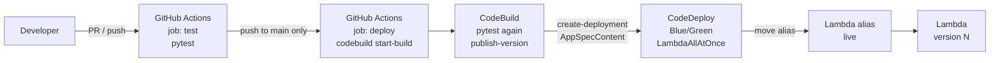

| Trigger | `test` job | `deploy` job |
|---|---|---|
| Pull request to `main` | ✅ runs | ⏭ skipped |
| Push (merge) to `main` | ✅ runs | ✅ runs after `test` passes |

The PR run acts as a quality gate; only merged code reaches AWS.

The `deploy` job is additionally guarded by a repository variable (`vars.DEPLOY_ENABLED == 'true'`). After the AWS resources were destroyed, the variable was left unset so pushes to `main` still run the tests but skip a deploy that has nothing to deploy to — a kill switch without editing the workflow.

### Observability

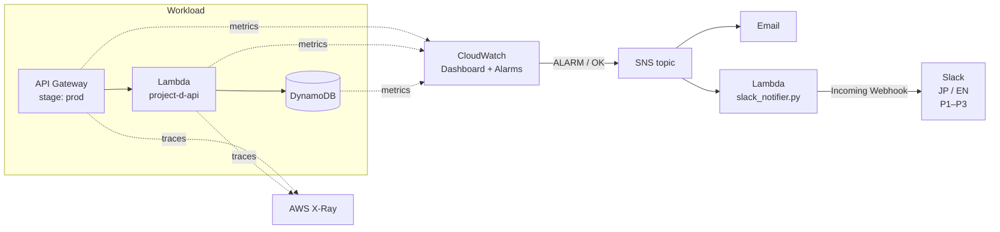

---

## Phase Summary

| Phase | Scope | Key deliverables | PR |
|---|---|---|---|
| 1 | Continuous Integration | `ci.yml` test job, pytest with mocked boto3 | #7 |
| 2 | Continuous Deployment | `buildspec.yml`, `appspec.yml`, `codebuild.tf`, `codedeploy.tf`, `ci.yml` deploy job | #8 |
| 3 | Metrics & Alerting | 3 new alarms + 6-widget dashboard; SNS → Lambda → Slack notifier | #9, #10 |
| 4 | Distributed Tracing | X-Ray active tracing on Lambda and the API Gateway stage | #11 |
| 5 | Documentation & Teardown | This README, `terraform destroy` | — |

---

## Phase 1 — Continuous Integration

- `ci.yml` runs `pytest project-d-serverless-api/tests/` on Python 3.12 for every PR and push to `main`.
- Tests import the Lambda handler directly with boto3 mocked, so CI validates application logic **without any AWS access**.

## Phase 2 — Continuous Deployment

**Flow inside CodeBuild (`buildspec.yml`):**

1. Install dependencies and run the unit tests again (defence in depth — CodeBuild can also be started manually, bypassing GitHub).
2. `aws lambda publish-version` → an immutable, numbered snapshot of the function.
3. Read the version the `live` alias currently points to.
4. Fill `<CURRENT_VERSION>` and `<TARGET_VERSION>` into `appspec.yml`.
5. `aws deploy create-deployment` with the appspec passed inline (`AppSpecContent`).

CodeDeploy then shifts the `live` alias from the current version to the new one.

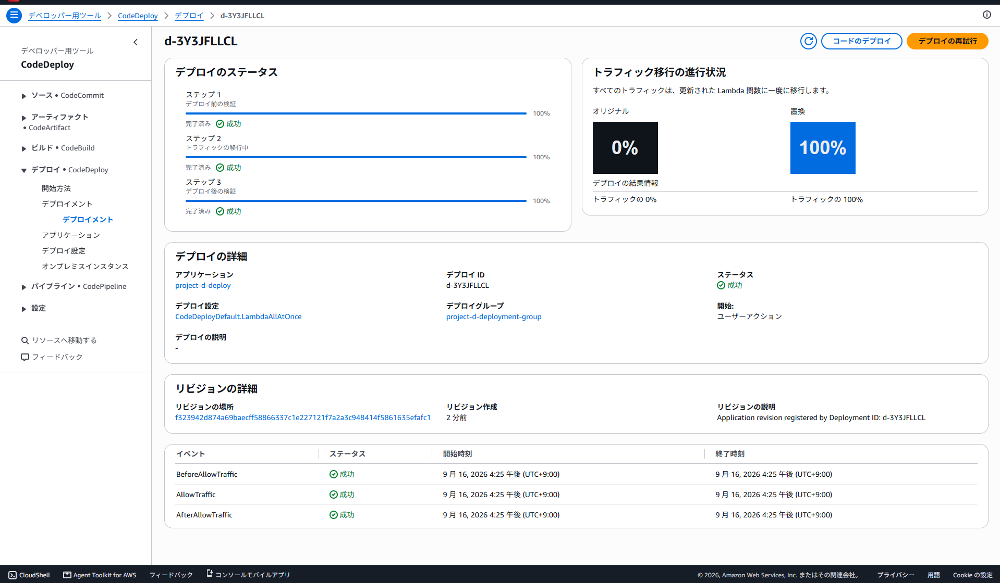
*Successful deployment: traffic moved 0% → 100% to the replacement version with `CodeDeployDefault.LambdaAllAtOnce`; all three lifecycle events succeeded.*

**Design decisions**

| Decision | Reason |
|---|---|
| Deployment type **Blue/Green** with traffic control | The only type CodeDeploy supports for Lambda. There is no in-place deployment: a new version is published and traffic moves to it. |
| Deploy through an **alias** (`live`) | The alias is a stable pointer. Rollback means pointing it back to the previous version — no rebuild, no redeploy. |
| **LambdaAllAtOnce** | Simplest configuration to validate the mechanics first. Canary / linear shifting is the next step (see below). |
| CodeBuild started **from GitHub Actions** | Keeps one pipeline definition in the repo; the PR gate and the deploy trigger are visible side by side in `ci.yml`. |

## Phase 3 — Metrics, Alarms & Slack Notifications

| Alarm | Metric | Threshold | Catches |
|---|---|---|---|
| `project-d-lambda-errors` | Lambda error count (log metric filter, from Project D) | ≥ 1 in 5 min | Application failures |
| `project-d-api-latency` | API Gateway `Latency` | ≥ 3000 ms | User-facing slowness |
| `project-d-lambda-duration` | Lambda `Duration` | ≥ 10000 ms | Function approaching timeout |
| `project-d-dynamodb-errors` | DynamoDB `SystemErrors` | ≥ 1 | Failures on the AWS side of the data layer |

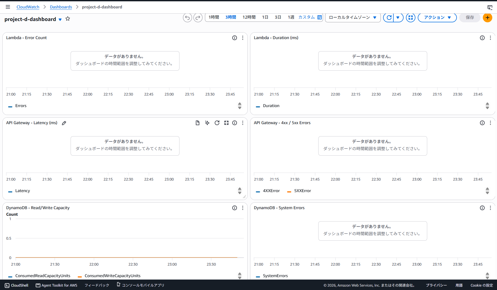
*Six widgets grouped by layer — Lambda, API Gateway, DynamoDB — so the request path reads top to bottom. (Captured on an idle environment, hence "no data" on most panels.)*

**Why a custom Lambda instead of AWS Chatbot?**
Chatbot would have been less work. A custom notifier (`slack_notifier.py`, standard library only — `urllib.request`, no dependencies to package) was chosen to:

1. Send **bilingual Japanese / English** messages — realistic for teams at foreign-affiliated companies in Japan.
2. Map alarm state to a **severity tier** so responders can triage from the notification alone:

   | Alarm state | Severity |
   |---|---|
   | `ALARM` | P1 — Immediate / 即時対応 |
   | `INSUFFICIENT_DATA` | P2 — Monitor |
   | `OK` | P3 — Resolved / 復旧済み |

3. Control the message format end to end.

The Slack webhook URL is a Terraform variable marked `sensitive = true`, supplied via a git-ignored `terraform.tfvars`.

**How it was tested:** `aws cloudwatch set-alarm-state` forced the alarm into `ALARM`, then back to `OK`, exercising the full path CloudWatch → SNS → Lambda → Slack without having to break the API.

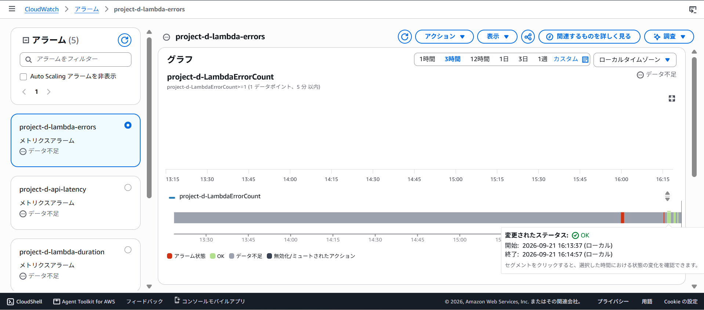
*State history of `project-d-lambda-errors`: the forced ALARM (red) followed by recovery to OK (green).*

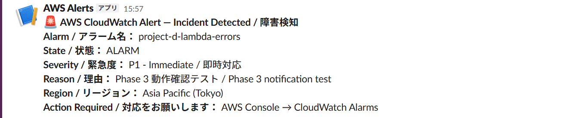
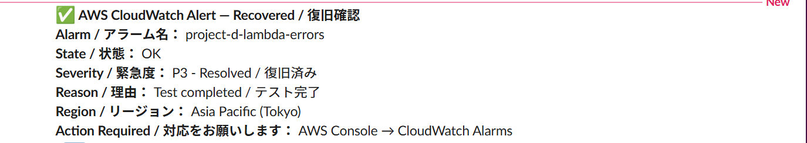
*The same alarm as it arrived in Slack: P1 on ALARM, P3 on recovery.*

## Phase 4 — Distributed Tracing (AWS X-Ray)

Three Terraform changes:
- `tracing_config { mode = "Active" }` on the Lambda function
- `xray_tracing_enabled = true` on the API Gateway stage
- `AWSXRayDaemonWriteAccess` attached to the Lambda execution role

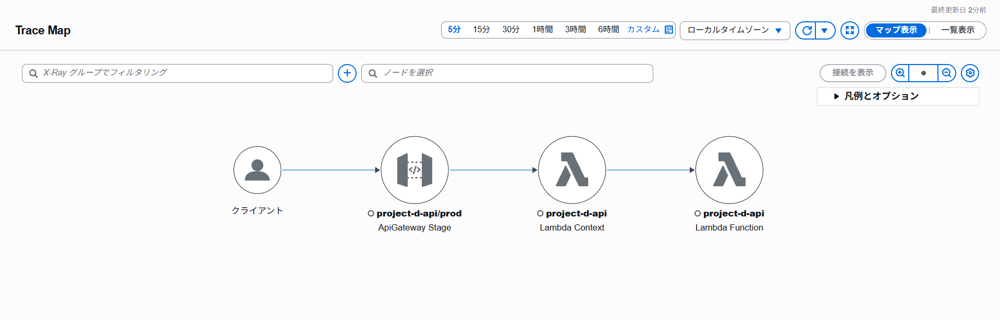
*Service map: Client → API Gateway stage → Lambda service (Context) → function code (Function).*

**Cold start, measured.** Three requests were sent back to back:

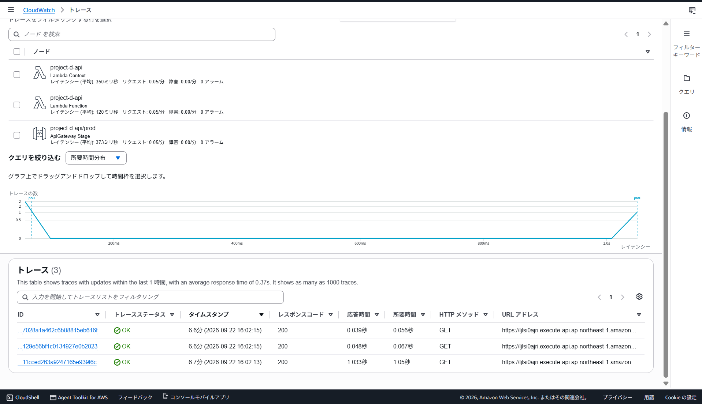

| Request (16:02) | Response time |
|---|---|
| 1st — cold start | **1.033 s** |
| 2nd — warm | 0.048 s |
| 3rd — warm | 0.039 s |

The cold start was about **20–25× slower** than warm invocations. A CloudWatch average hides this; a trace shows it per request.

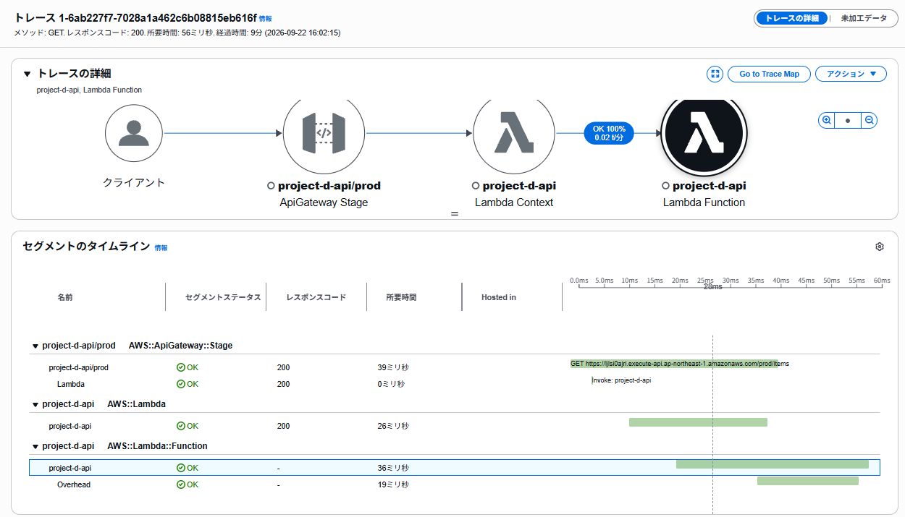
*Segment timeline of a warm request: 39 ms at API Gateway, of which the function itself ran 36 ms.*

CloudWatch answers *"is something wrong?"*; X-Ray answers *"where in the request did the time go?"* — the thermometer and the surgeon.

---

## Troubleshooting Log

| # | Phase | Symptom | Root cause | Fix |
|---|---|---|---|---|
| 1 | 1 | `NoRegionError` in CI | boto3 client created at import time; the runner has no AWS config | Mock boto3 in the tests |
| 2 | 1 | `KeyError: TABLE_NAME` | Handler reads an env var that Terraform sets in AWS, absent in CI | Set the variable in test setup |
| 3 | 1 | Tests behaved unexpectedly | `import index` placed inside test functions | Import once at module level, after the mocks |
| 4 | 1 | `AttributeError` on handler | Tests called `lambda_handler`; the function is `handler` | Align the name |
| 5 | 2 | Terraform rejected CodeBuild source config | `connection_arn` is not supported on `aws_codebuild_project` | Authorized the GitHub connection once in the console |
| 6 | 2 | CodeDeploy deployments failed twice | Appspec passed through shell escaping arrived malformed (quoting, then a hand-computed `sha256`) | Build the revision as a Python dict and pass it with `json.dumps` via `subprocess` — no shell quoting involved |

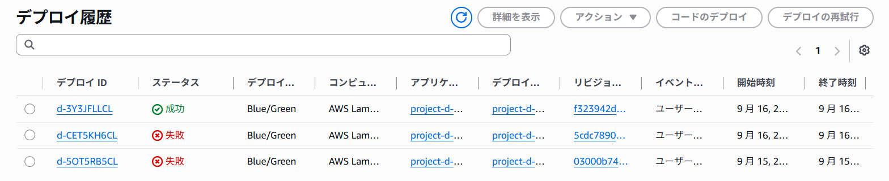
*Issue #6 in the record: two failed attempts, then success.*

**Takeaway:** issues 1–4 were test-environment problems, not application bugs; issue 6 was a transport problem, not a content problem. Asking *"which layer is actually wrong?"* before editing code was the most reusable lesson of the project.

---

## Known Limitations & What I Would Change Next

Listed deliberately — these are the first things I would raise in a production review.

1. **API Gateway invokes `$LATEST`, not the `live` alias.**
   X-Ray's trace logs show `Version: $LATEST` on API requests. The pipeline publishes versions and moves the alias correctly, but live traffic does not go through the alias yet, and CodeBuild publishes whatever code is already on `$LATEST` rather than uploading new code itself.
   *Fix:* add `aws lambda update-function-code` before `publish-version` in `buildspec.yml`, and point the API Gateway integration at the alias ARN (with a matching `aws_lambda_permission`).
   *Why it matters:* this gap was **found by the observability layer built in Phase 4** — tracing is not only for performance, it verifies that the system actually behaves as designed.
2. **The `live` alias was created manually.** It should be an `aws_lambda_alias` resource (imported into state) so the environment is fully reproducible.
3. **Long-lived AWS keys in GitHub Secrets.** Production should use **GitHub OIDC federation** with a least-privilege IAM role, removing stored keys entirely.
4. **No automatic rollback.** CodeDeploy can roll back when a CloudWatch alarm fires during a deployment; connecting the Phase 3 alarms to the Phase 2 deployment group closes the loop between CI/CD and observability.
5. **All-at-once traffic shift.** `LambdaCanary10Percent5Minutes` combined with (4) would limit the blast radius of a bad release.
6. **Local Terraform state.** A team setup would use an S3 backend with state locking.

---

## Cost

| Item | List price / month |
|---|---|
| CloudWatch Dashboard | $3.00 |
| CloudWatch Alarms | ~$0.10 each |
| Lambda / API Gateway / DynamoDB / CodeBuild / X-Ray | Within free tier at this volume |

Actual spend was effectively zero (account credits). All resources were removed with `terraform destroy` after verification.

---

## Related Projects

- [Project D — Serverless API](../project-d-serverless-api/) — the workload this project operates
- Project F (planned) — Amazon Bedrock AI platform, reusing this serverless + CI/CD foundation
